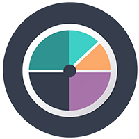

  

<h3 align="center">plutonomic</h3>

---

 FPersonal finance analysis.
     

## Table of Contents

- [About](#about)

## About 

Plutonomic will read exported transaction data from your bank (which you need to do manually from your banking website) and run a temporal analysis on that data, providing insight
with some default and custom filters to view via a dashboard. Data is not stored, as it is read from the client's local drive and provides the user with the option to use
local or session storage in the browser.

Currently, Comma Separated Value is the default file format for imported data, with other options to be made available in the future, such as Xlsx. The user can purge the data
or switch between preferred browser storage options at any time.

The purpose of the app is to provide a simple overview of spending patterns, frequent debtors and ingoing versus outgoing cashflow over time, which can also be customized,
such as days, weeks or months.

